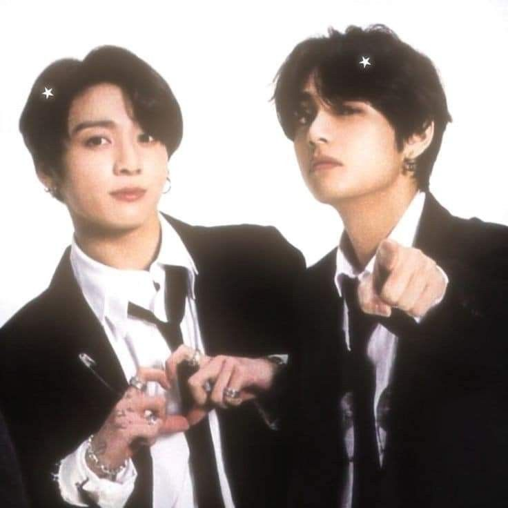
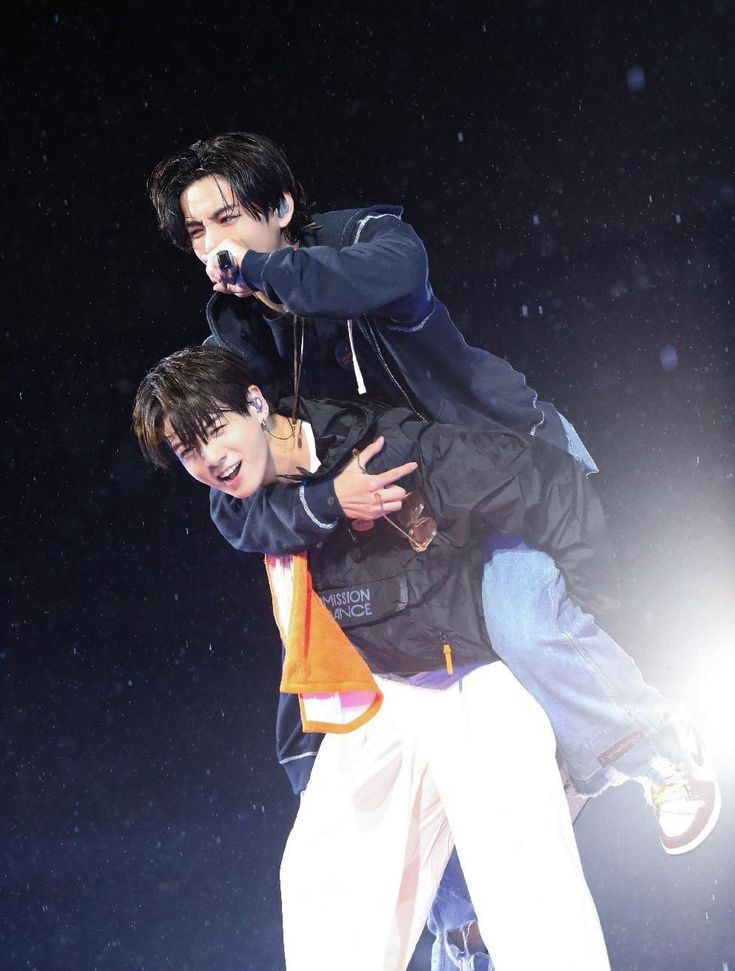
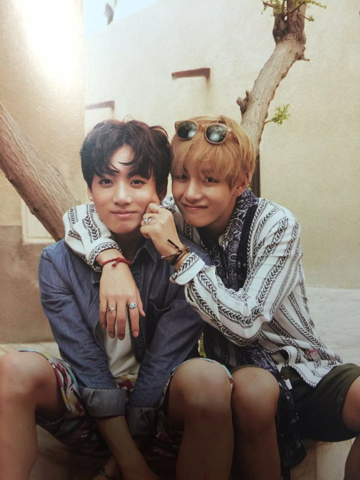
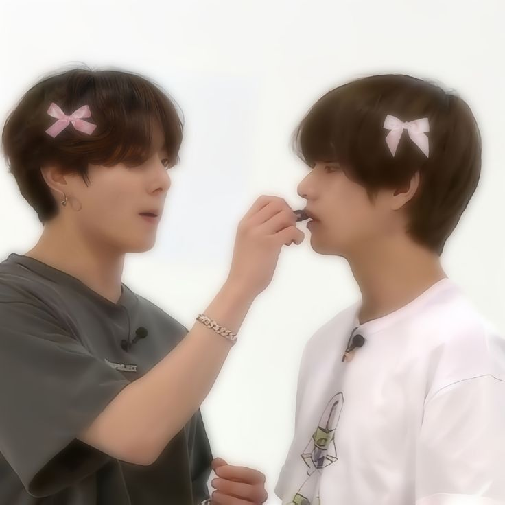
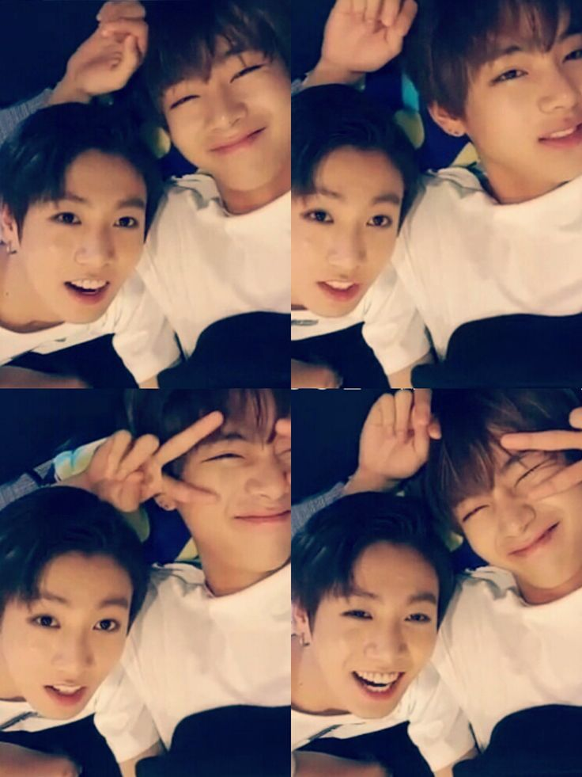

# taekookie
<!DOCTYPE html>
<html lang="pt-br">
<head>
  <meta charset="UTF-8">
  <title>Para Meu Melhor Amigo</title>
  
</head>
<body>
  <header>
     For my best bud
  </header>

  <main>
    <section class="textao">
      <h2>Um textão só pra você!</h2>
      

        Bom, como eu vou começar esse texto eu não sei, mas eu espero que, depois desse texto, não restem dúvidas para você do quanto eu te amo e que eu tenho muito medo de te perder por bobagem ou por qualquer outra coisa.

Hoje não é nenhum dia especial em específico, mas é mais um dia em que nós estamos juntos e que podemos compartilhar momentos juntos. E só de pensar que isso é possível já me deixa muito feliz. Então, saiba que cada dia da minha vida em que você participa é um dia especial para mim — seja um dia em que você está me dando bronca, seja um dia em que eu estou te dando bronca, seja um dia em que você está me batendo, seja um dia em que a gente está se xingando, seja algum dia em que a gente está jogando e se xingando ao mesmo tempo, seja algum dia triste para mim e você está me consolando, seja um dia ruim para você e eu estou aqui te consolando, seja um dia feliz em que estamos compartilhando coisas incríveis que acontecem na nossa vida — seja qualquer tipo de momento, mas que seja com você.

No dia 3 de maio de 2025, eu não sabia o quanto a minha vida ia mudar depois de um vídeo no TikTok que eu vi sobre uma tal de house. Eu nunca tinha participado disso, e sempre quis participar, e esse era o momento certo. Porque eu não entrei em uma house qualquer — eu entrei em uma família. E nela eu conheci o melhor amigo de todos os tempos. Melhor amigo que qualquer um queria ter. E eu desejo muito que todas as pessoas tenham a oportunidade de ter um amigo tão incrível como você... mas que seja outro, porque você já é meu, e sim, eu tenho ciúmes.

Desde a primeira foto que eu postei no Instagram da house, de nós dois juntos, a gente nunca mais parou de se falar. E pode ter sido só por poucos dias ainda, mas eu sinto que essa amizade vai durar por anos. E sim, algum dia eu vou te encontrar nesse mundo e vou te perturbar ainda mais. Se eu já te perturbo mesmo sendo virtualmente, imagine se eu morasse perto de ti... eu ia estar na tua casa 24 horas por dia, eu ia morar com você basicamente, e você também iria morar na minha casa. Até porque eu acho que eu não consigo mais viver sem ti.

Quando eu tô triste ou quando eu tô feliz, sempre que eu peço — ou também quando eu não peço — um texto, você faz com o maior carinho do mundo, um texto gigante. A primeira vez que eu vi um texto seu eu nem tive palavras para descrever o quanto eu estava emocionada e feliz. Porque eu nunca tinha recebido um texto assim. Nunca ninguém cuidou tão bem de mim assim, a não ser minha mãe e meu pai. Você é o irmão que eu nunca tive, é o melhor amigo que eu nunca tive, e é a pessoa com quem eu quero sempre estar ao meu lado. Sabe por quê? Porque você é aquele que sempre vai estar quando eu precisar — e sempre quando eu não precisar também. É aquele que sempre vai me dar um bom dia. É aquele que nunca vai conseguir dormir sem antes me dar boa noite. É aquele que sempre vai me procurar, independente da situação. É aquele que sempre tá lembrando de mim, enquanto todo o resto nem lembra da minha existência.

Então sim, Jungkook, eu tenho muito medo de te perder. Porque te encontrar não foi fácil. E acredite: você apareceu no momento em que eu estava mais precisando na minha vida. No momento em que eu pensei que nada mais poderia me fazer feliz. No momento em que eu pensava que tava sozinho. No momento em que eu pensei que tudo tinha acabado, e que iria ser muito difícil continuar.

Então, por favor, me manda mensagem, me manda áudio, me manda foto, me manda vídeo, me liga, faz ligação de vídeo — faz tudo que for possível, mas não vai embora. Porque eu não sei como suportar mais essa vida sem ter você ao meu lado. Sem ter alguém para me animar todos os dias. Sem ter um colo de irmão. Você é aquele que me entende mesmo eu estando calado. É aquele que ri das minhas piadas bestas que nem eu mesmo rio. E eu sei que é aquele que sempre vai querer me ver feliz, e que nunca vai deixar ninguém me fazer mal.

E eu também me apeguei. E quando eu me apego em algo, eu não quero mais largar. Nunca mais. Então agora você vai ter que me aguentar para o resto da sua vida. E vai se acostumando, porque a gente é para sempre. E eu não falo isso da boca pra fora, porque eu nunca falo isso pra ninguém quando realmente é verdadeiro. Eu aprendi a não demonstrar meus sentimentos, ou não sou muito emocionado, então quando eu demonstro, é para as pessoas certas e que são muito importantes na minha vida, e que eu nunca, jamais, quero perder. Que se for para a gente se separar, que seja só quando a morte nos separe.

Você sempre me ameaça, mesmo que na brincadeira, quando eu digo que vou embora. Mas você sabe que eu não sou doido o suficiente pra fazer isso. Porque eu tenho medo de te perder. Então por que eu iria embora? Não tem lógica. E você sempre diz que, se eu for embora, vai me puxar pelos cabelos de volta. E eu fico feliz, porque isso prova que você também não quer que eu vá embora. Mas só você sabe o quanto eu sou medroso. Então eu ainda tenho medo de que algo aconteça e que a gente se separe. Mas eu vou fazer de tudo para isso nunca, nunca, jamais acontecer. Porque, como eu disse, eu não sei como seguir essa vida sem você. A vida não tem mais graça sem você.

Então, eu quero estar contigo em todo momento. Quero viver todos os momentos da minha vida contigo. Cada hora, cada minuto — acho que não vai ser possível cada segundo, até porque a gente também tem uma vida para cuidar — mas eu vou fazer de tudo para sempre estar aqui contigo. Porque eu te amo. Eu amo cada coisinha sua. Eu amo nossas calls, nossas conversas. Eu amo seus áudios. Eu amo todo o tempo que a gente passa junto — seja jogando, seja fazendo qualquer outra coisa, até "brigando". Eu amo seu sorriso. Eu amo seu gosto musical, mesmo que às vezes seja um pouco "diferente" do meu. Eu amo seus gostos. E eu ainda digo que um dia eu vou lutar jiu-jitsu com você. Quando? Não faço a mínima ideia. Mas com o tanto que você prometa não me matar, tá tudo certo pra mim.

E sim, eu ainda quero viver muita coisa contigo. E a gente vai viver.

Então, por favor, fica mais um pouco. Me suporta mais um pouco. Porque o Taehyung aqui te ama muito. Ao ponto de deixar o meu orgulho de lado e falar pra todo mundo que eu te amo. E ao ponto de até falar que eu sou passivo (mesmo eu não sendo).

Eu te amo muito, muito, muito, mesmo que eu não consiga expressar nem com todas as palavras desse mundo, nem com todas as palavras mais bonitas que existem.

Eu te amo, Kookie.
Eu te amo, Jungkook.
Eu te amo, Jeon Jungkook.
Eu te amo, coelho.
Eu te amo, irmãozinho.
Eu te amo, hyung.
Eu te amo, maninho.
Eu te amo, Mih.
Eu te amo, Milena.

Você é a melhor amiga do mundo.

Com todo o meu amor,
Teteco 
      

    </section>

    <section class="spotify">
      <h2>Sua Playlist no Spotify 🎧</h2>
      <iframe style="border-radius:12px" 
        src="https://open.spotify.com/embed/playlist/3ukaWKmrTuhvSLAn4uysOI?utm_source=generator"
        width="100%" height="380" frameBorder="0" allowfullscreen="" 
        allow="autoplay; clipboard-write; encrypted-media; fullscreen; picture-in-picture" loading="lazy">
      </iframe>
    </section>

    <section class="youtube">
      <h2>Músicas que me lembram você 🎶</h2>
      <ul>
        <li><a href="https://youtu.be/QU9c0053UAU?si=kho-rpRC9ELFqdyt" target="_blank">정국 (Jung Kook) 'Seven (feat. Latto)' Official MV</a></li>
        <li><a href="https://youtu.be/HYzyRHAHJl8?si=huOlpbxMsQe5la_5" target="_blank">V 'Love Me Again' Official MV</a></li>
        <li><a href="https://youtu.be/dNNCghL2yOo?si=q74o3QNJLHeiVdvm" target="_blank">Como Jungkook e V se tratam - Momentos TaeKook</a></li>
      </ul>
    </section>

    <section class="fotos">
      <h2>Nossas Fotos 📸</h2>
      

        
        
        
        
        
        
        
        
        
        
        
        
        
        
        
        
        
        
        
        
        
        
        
        
        
        
        
        
        
        
        
        
        
        
        
        
      

    </section>
  </main>

  <footer>
    Feito com carinho por você 
  </footer>
</body>
</html>

